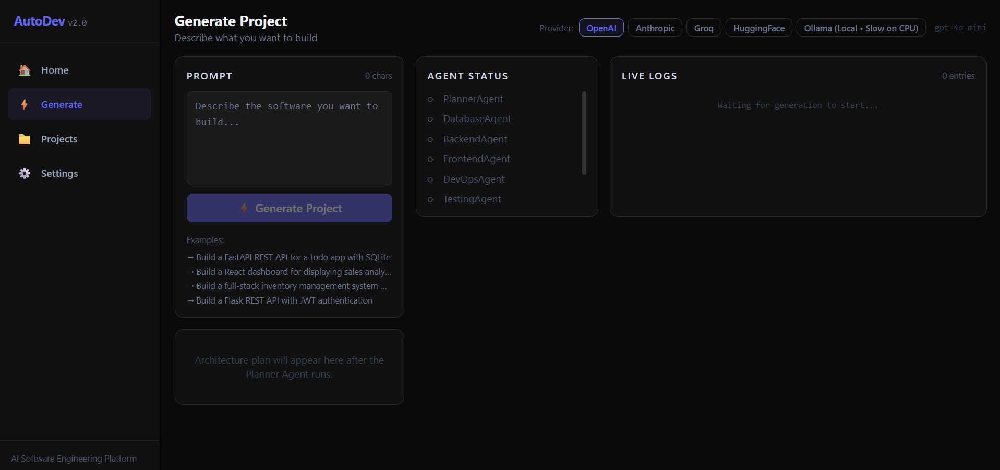
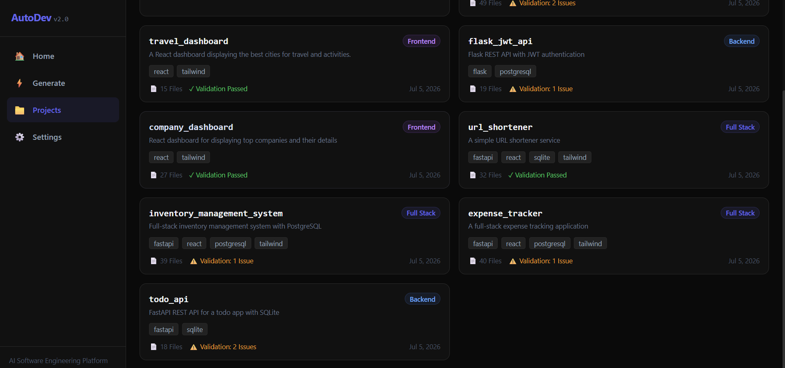
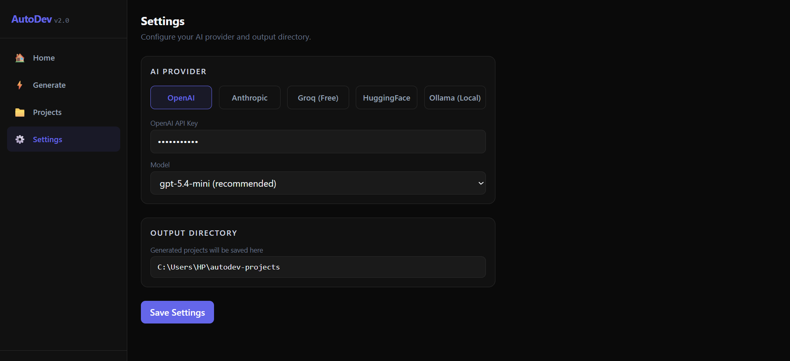

# AutoDev 2.0 — Multi-Agent AI Software Engineering Platform


AutoDev turns a plain-English project description into a scaffolded full-stack
codebase. A prompt like *"Build a URL shortener with Docker support"* is run
through a pipeline of specialized AI agents — Planner, Database, Backend,
Frontend, DevOps, Testing, Documentation — followed by three deterministic,
zero-LLM phases: a syntax Validator, a one-shot Targeted Repair pass, and a
cross-file Consistency Checker that verifies the agents' outputs actually
agree with each other.

A Java/Spring Boot **platform service** sits alongside the Python pipeline and
owns everything identity-related: user accounts, JWT authentication, project
ownership, and per-user LLM provider credentials — encrypted at rest with
AES-256-GCM, never stored in plaintext, never shared across accounts. Python
still owns all AI execution; disk remains the source of truth for generated
project artifacts.

> **What this is, honestly:** a multi-agent scaffolding pipeline with strong
> coordination and diagnostics, not a guarantee of production-ready output.
> Every generated project is written to disk with a validation report and a
> consistency report so you can see exactly what (if anything) needs manual
> review — nothing is hidden or silently assumed correct.

## 🚀 Quick Start

```bash
git clone https://github.com/parthj732005/Autodev-2.0.git
cd Autodev-2.0

# 1. Identity/metadata service + its database
docker compose up -d

# 2. Backend (new terminal)
cd backend
pip install -r requirements.txt
python -m uvicorn app.main:app --reload

# 3. Frontend (new terminal)
cd frontend/autodev-ui
npm install
npm run dev
```

Open your browser at:

```
http://localhost:5173
```

Register an account, then configure your preferred LLM provider from the
**Settings** page — your API key is encrypted and scoped to your account only.

> **Recommended:** Use OpenAI, Anthropic, or Groq for the highest-quality generations. Ollama is supported for fully local inference but is typically slower on CPU-only systems.

## Architecture

```
React frontend
    │
    ├──── auth (register/login), project ownership, provider settings
    │      via JWT ─────────────────────────────────┐
    │                                                ▼
    │                              platform-service (Spring Boot)
    │                              ├─ Users, BCrypt password hashes
    │                              ├─ Project ownership (Postgres)
    │                              └─ Per-user provider credentials,
    │                                 AES-256-GCM encrypted at rest
    │                                                ▲
    │                                                │ platform_client.py
    │                                                │ (the ONLY module that
    │                                                │  knows this service's
    │                                                │  HTTP details)
    ▼                                                │
FastAPI backend ───────────────────────────────────┘
    │
    ▼
PlannerAgent ── produces the authoritative plan: tech stack, api_routes,
    │            entities, environment_variables, docker_entry_point
    ▼
DatabaseAgent ─ owns the canonical SQLAlchemy models (database/models.py)
    │
    ▼
BackendAgent ── implements exactly the API contract from the plan
    │
    ▼
FrontendAgent ─ calls exactly the backend's planned endpoints
    │
    ▼
DevOpsAgent ─── Dockerfile / docker-compose.yml / .env.example using the
    │            plan's exact entry point and env vars
    ▼
TestingAgent ── pytest suite covering every planned route
    │
    ▼
DocumentationAgent ─ README scoped to the real API contract
    │
    ▼
ValidatorAgent ─ static syntax check (ast.parse for Python, bracket-balance
    │             for JS) — catches malformed files, not logic errors
    ▼
Targeted Repair ─ ONE repair attempt per file with a real syntax error (never
    │              a loop). A fix is kept only if independently re-verified;
    │              otherwise the original file is left untouched.
    ▼
ConsistencyChecker ─ pure Python, no LLM calls — verifies frontend calls,
    │                 tests, README, Docker entry point, and requirements.txt
    │                 all agree with what the backend actually implements
    ▼
Project written to disk → metadata synced to platform-service (best-effort;
                           a sync failure never affects the completed generation)
```

Every downstream agent receives the same shared "API contract" block (routes,
entities, env vars) that the Planner produces — this is what keeps a
5-file-frontend and a 12-file-backend from silently disagreeing about a route
name or a model shape.

**Generation is authenticated end-to-end.** The WebSocket requires a valid JWT
before it will start a generation; the backend resolves your identity and
your own decrypted provider config from the platform service exactly once per
generation — never a shared global credential, never cached across requests,
so two concurrent generations from different accounts always use their own
provider/model/API key and can never observe each other's credentials.

## Key Features

- **Per-user identity and project ownership.** Every generated project is
  tied to the account that created it. Project browsing, file trees,
  validation/repair/consistency reports, and setup instructions are all
  authorization-checked server-side — one account can never read another's
  projects, even by guessing an identifier.
- **Encrypted, per-user provider credentials.** API keys for OpenAI,
  Anthropic, Groq, and HuggingFace are AES-256-GCM encrypted at rest in
  PostgreSQL. The full key is never returned by any API response after it's
  saved — only a masked "configured" status and a 4-character suffix.
- **5 LLM providers, swappable per generation:** OpenAI, Anthropic, Groq,
  HuggingFace (Inference Router), and Ollama (local, no API key required).
- **Live WebSocket streaming** of every agent's status and log output while a
  project generates, with a project tree, validation report, and consistency
  report shown once it completes.
- **Real cancellation.** Clicking Stop actually cancels the in-flight asyncio
  task and interrupts the pending LLM HTTP request server-side — it doesn't
  just close your browser's side of the socket while the backend keeps
  running in the background.
- **Fail-fast guardrails:** a bad/expired API key, a missing model, or an
  unconfigured provider is detected before any LLM call runs — including
  before the pipeline is even constructed, not partway through.
- **Targeted Repair Phase** — after validation, only the files with a real
  syntax error get exactly one LLM-driven fix attempt (never a retry loop).
  A fix is accepted only if it's independently re-verified to actually pass;
  otherwise the original file is kept, untouched, rather than risking a
  worse, unverified rewrite.
- **Same-name collision safety** — regenerating with a project name that
  already exists on disk lands in a fresh `_2`/`_3`/... folder instead of
  silently overwriting or mixing files with the previous project.
- **Project browser** — every generated project persists its plan, files,
  validation report, repair report, consistency report, and full generation
  log, browsable later from the Projects page (scoped to your own projects),
  plus an "Open in VS Code" button.
- **AI-generated setup instructions** per project, tailored to its actual
  file layout (correctly detects whether the frontend lives at the project
  root or in a subfolder — it does not assume a fixed folder name).
- **Light/dark theme toggle**, switchable from the sidebar and persisted
  across sessions. Switching themes is a pure CSS repaint — it never
  interrupts an in-progress generation, resets typed text, or touches
  authentication state.

## Getting started

### Prerequisites
- Python 3.10+
- Node.js 20+
- Docker (for the platform service + PostgreSQL — no local Java/Maven install needed)
- At least one LLM provider: a free [Groq](https://console.groq.com) API key
  is the easiest way to try this without any local setup, or run
  [Ollama](https://ollama.com) locally for a fully offline/free option.

### 1. Platform service (identity, project ownership, provider credentials)

```bash
cp platform-service/.env.example .env
# then edit .env if you want anything beyond local-dev defaults

docker compose up -d
```

This starts PostgreSQL and the Spring Boot service on `http://localhost:8081`.
Generate a real encryption key for anything beyond local dev:

```bash
openssl rand -base64 32   # → AUTODEV_CREDENTIAL_ENCRYPTION_KEY
```

### 2. Backend

```bash
cd backend
pip install -r requirements.txt
python -m uvicorn app.main:app --host 127.0.0.1 --port 8000 --reload
```

The backend serves on `http://127.0.0.1:8000`.

### 3. Frontend

```bash
cd frontend/autodev-ui
npm install
npm run dev
```

Open the printed local URL (default `http://localhost:5173`), register an
account, and configure a provider from the Settings page.

### Configuration

Settings are split by scope:

| Scope | Where it lives | What it covers |
|---|---|---|
| **Per-user** | Platform service (Postgres, encrypted) | Selected provider, model, API key(s) — set from the Settings page, never shared across accounts |
| **Server/machine** | `backend/settings.json` | `output_directory` only — where generated projects are written on this machine |

`backend/settings.json` no longer stores API keys — that file is only ever
read for `output_directory` now. It's still gitignored regardless.

Platform service environment variables (see `platform-service/.env.example`):

| Key | Purpose |
|---|---|
| `DB_NAME` / `DB_USERNAME` / `DB_PASSWORD` | PostgreSQL connection |
| `JWT_SECRET` | Signs authentication tokens — set a real random value beyond local dev |
| `AUTODEV_CREDENTIAL_ENCRYPTION_KEY` | Base64-encoded 32-byte AES key encrypting stored provider API keys. Missing/malformed values fail safely (never falls back to plaintext) |
| `PLATFORM_SERVICE_URL` | Where the FastAPI backend reaches this service (default `http://localhost:8081`) |

**Never commit a real `.env` file or `backend/settings.json`** — both are
gitignored.

## Running the tests

```bash
# Python (96 pipeline tests + 28 auth/ownership/provider-isolation tests)
cd backend
pip install -r requirements-dev.txt
pytest -v

# Java (platform service — 45 tests)
cd platform-service
mvn test   # or, without a local JDK: docker run --rm -v "$PWD":/build -w /build maven:3.9-eclipse-temurin-21 mvn test
```

Both suites are entirely offline — no API keys, no live network calls, no
external LLM providers required (the Java suite uses an in-memory H2 database
via the `test` profile, not real Postgres).

**Python (124 tests)** covers the deterministic pieces of the pipeline: the
Consistency Checker's route-matching and entry-point-verification logic, the
Planner's JSON-extraction and default-filling helpers, the Targeted Repair
Phase (one-attempt-per-file, revert-on-failure, never a loop), the structural
backstops in `BackendAgent`/`DevOpsAgent`, file-writing/collision behavior in
`ProjectGenerator`, the WebSocket authentication handshake and cancellation
race, per-generation provider-config isolation (two concurrent generations
never observe each other's credentials), and ownership/path-traversal checks
on project artifact access.

**Java (45 tests)** covers registration/login/JWT auth, project ownership
(cross-user access always rejected, same 404 whether a project doesn't exist
or belongs to someone else), provider-settings isolation between accounts,
API-key encryption round-tripping, and safe failure when the encryption key
is missing or malformed.

CI (`.github/workflows/ci.yml`) runs all three suites (Python, Java, frontend
lint+build) on every push and pull request to `main`.

## Known limitations

This project is transparent about what it doesn't do yet, rather than
overstating what it does. These are grounded in an actual, reproducible audit
— not speculation:

- **Validation is syntactic, not semantic — a project can pass every check
  and still fail to boot.** `ast.parse` confirms a file is grammatically
  valid Python; it cannot see an undefined name, a missing import, a relative
  import used from a non-package entry point, or a frontend import path that
  doesn't resolve. A generated project has been confirmed, live, to report
  "0 validation errors, 0 consistency errors" and still throw
  `ImportError`/`NameError` on the very first line executed. **The single
  highest-leverage next feature is an import-resolution check, or a real
  boot test** (`pip install` + `uvicorn`, `npm install` + `vite build`) —
  neither exists yet.
- **The Targeted Repair Phase only fixes syntax errors it can already
  detect** (Python `ast.parse` failures, JS/JSX bracket imbalance). It has no
  visibility into the semantic bugs above, so it cannot fix them.
- **`duplicate_models` matches by class name, not by database table.** Two
  models targeting the same `__tablename__` under different class names are a
  genuine conflict but are not flagged, because the check only compares class
  names for exact duplicates.
- **Legacy/ownerless projects on disk aren't shown in the Projects page.**
  Projects generated before per-user ownership existed (or synced while the
  platform service was down) remain physically on disk untouched, but are
  excluded from the normal authenticated project list until an explicit
  import/claim mechanism exists — none has been built yet.
- **Generation quality varies by prompt complexity and by model.** Narrow,
  single-purpose prompts tend to come out clean; prompts that bundle many
  subsystems (auth + payments + admin dashboard + analytics, for example)
  are more likely to hit LLM token-limit truncation or incomplete
  `requirements.txt` generation. Smaller/local models (e.g. HuggingFace's
  free-tier 7B coder model, or a small local Ollama model) have been observed
  to produce messier, less-consistent file structures than larger models
  (GPT-4-class, Claude, Groq's 70B Llama) on the same prompt.

## 🖥️ Application Walkthrough

The screenshots below illustrate the complete workflow, from configuring an LLM provider to generating, validating, repairing, and managing AI-generated software projects.


## Home

The landing page introduces the multi-agent architecture, supported LLM providers, and the end-to-end software generation workflow.

📄 [Home Page](screenshots/HomePage.pdf) · 📄 [Home Page (light theme)](screenshots/HomePageLightTheme.pdf)

---

## Generate

Create projects from natural-language prompts while monitoring each agent's progress through live logs, validation results, automatic repair, and consistency analysis.



📄 [Detailed Generation Example](screenshots/GeneratePage2.pdf)

---

## Projects

Browse your own previously generated projects along with their technology stack, validation status, and generated file statistics.



---

## Project Details

Inspect an individual project with generated setup instructions, file tree, validation report, consistency analysis, and generation logs.

📄 [Flask JWT API Example](screenshots/Project1.pdf)

📄 [Notes Maker Example](screenshots/Project2.pdf)

📄 [Notes Maker Example (light theme)](screenshots/Project3LightTheme.pdf)

---

## Settings

Configure your own LLM provider, model, and API key — encrypted at rest and never shared with other accounts — plus the output directory for generated projects.




## License

MIT — see [LICENSE](LICENSE).
